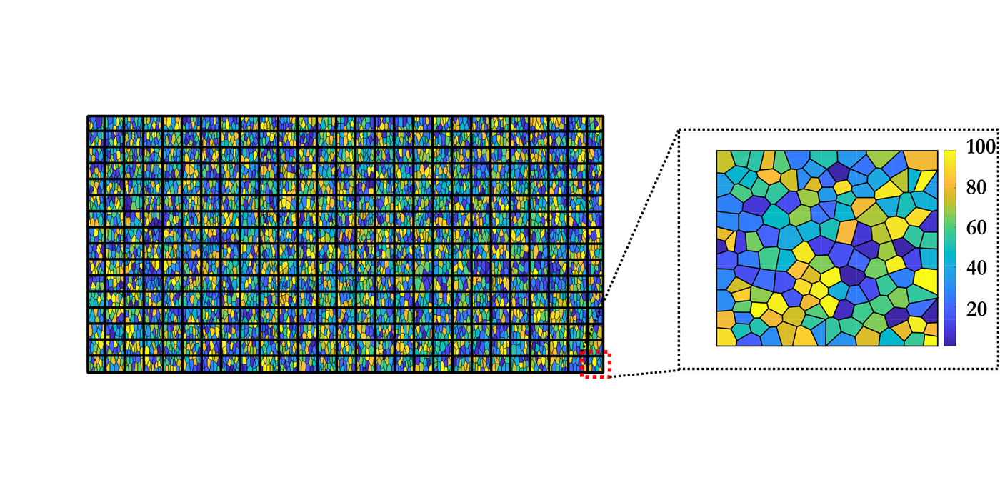
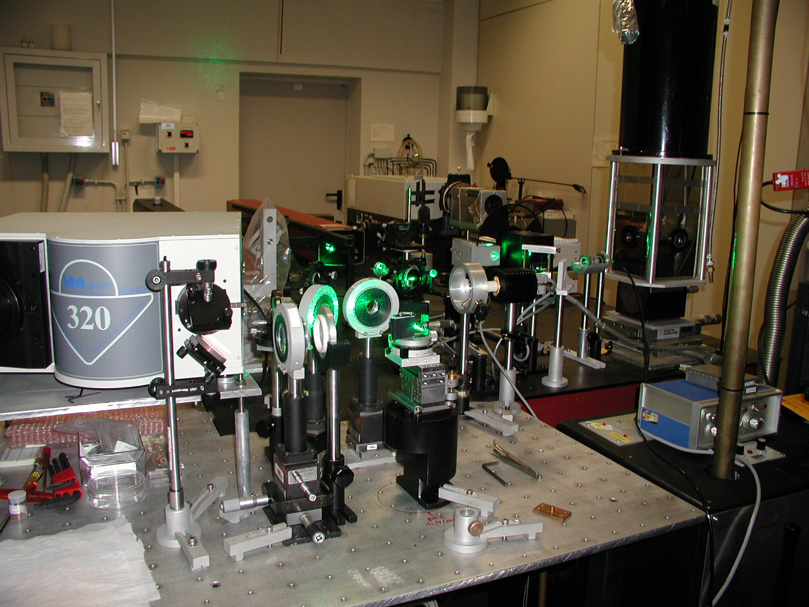
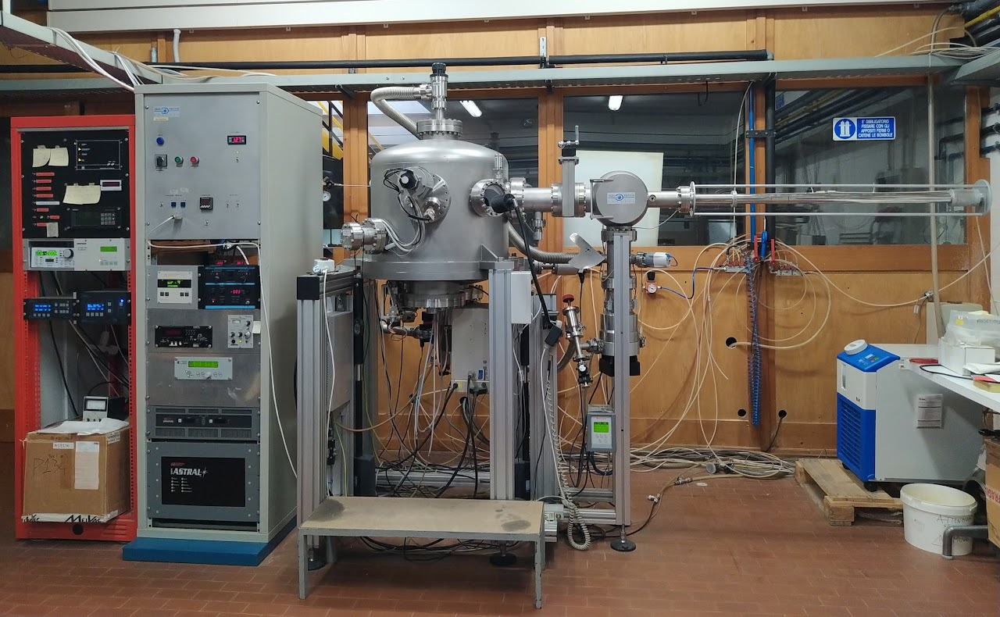
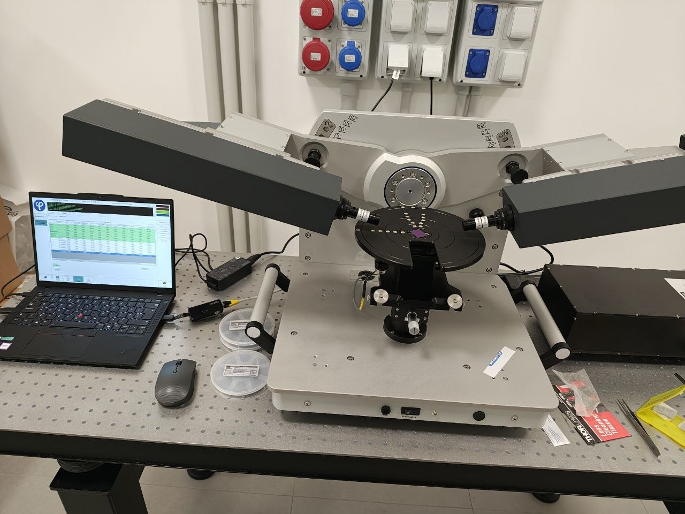
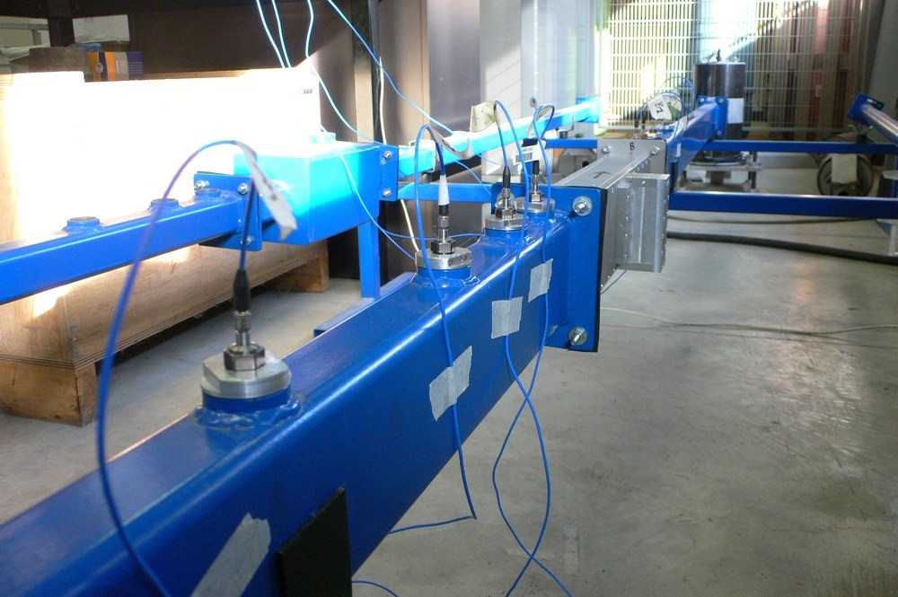
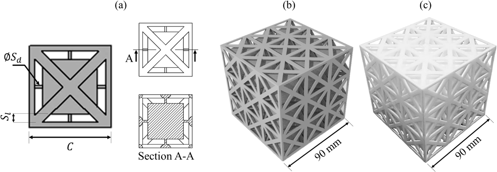

<section class="hero hero-home reveal">

<h1>Advanced Meta-materials and Meta-Structures for Adaptable, Resilient and Sustainable renewable energy power plants</h1>

A European training network advancing fundamental and translational research.

<a href="{{ "/research/" | relative_url }}" class="btn btn-primary">Explore Research</a>
<a href="{{ "/training/" | relative_url }}" class="btn btn-primary">Explore Training </a>

</section>

<section class="intro-section reveal">

<h2>Our Vision</h2>

Next-generation renewable energy technologies are no longer just an alternative; they are the cornerstone of the global net-zero green transition. Accelerating the deployment of clean energy is our most critical lever in mitigating anthropogenic climate change and achieving long-term planetary sustainability. However, the rapid scaling of these technologies exposes inherent bottlenecks. Current green infrastructure often suffers from suboptimal design efficiencies and a heavy reliance on Critical Raw Materials (CRMs)—scarce resources and minerals that are vulnerable to supply chain disruptions and ecological extraction concerns. To overcome this, we need a paradigm shift toward circular economy principles and eco-conscious, disruptive design.

Backed by the prestigious Marie Skłodowska-Curie Actions programme, the Met2Adapt initiative is stepping up to bridge this innovation gap. Met2Adapt operates as an interdisciplinary incubator, designed to empower a new vanguard of visionary researchers. Their focus is on pioneering the next frontier of smart and sustainable metamaterials and metastructures. We seek to engineer advanced architectures to unlock unprecedented, macroscopic properties that can directly supercharge the renewable energy sector.

</section>

<section class="intro-section reveal">
<!-- Carousel inside the overlay -->

<button class="hc-prev" aria-label="Previous slide" type="button">‹</button>
<button class="hc-next" aria-label="Next slide" type="button">›</button>

<button role="tab" aria-selected="true" aria-controls="slide-0" data-to="0" type="button"></button>
<button role="tab" aria-selected="false" aria-controls="slide-1" data-to="1" type="button"></button>
<button role="tab" aria-selected="false" aria-controls="slide-2" data-to="2" type="button"></button>

</section>

<section class="intro-section reveal">

<h2>Our Partners</h2>
















<h2>Our Associated Partners</h2>
















</section>



